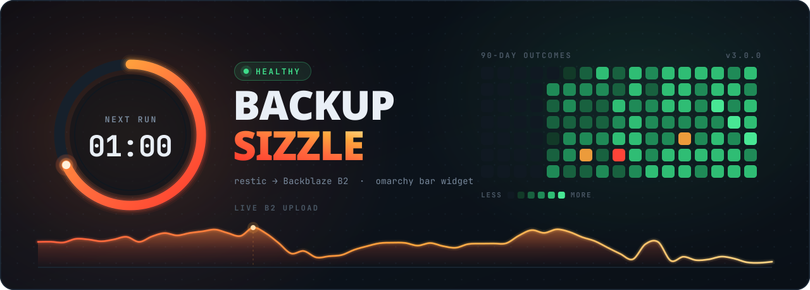

<p align="center">
  
</p>

# Backup Sizzle

An [Omarchy](https://omarchy.org) bar widget that monitors a **restic → Backblaze B2**
backup: live upload throughput, a countdown ring to the next run, a 90-day outcome
calendar, dedup/churn ratios, a snapshot browser, and per-run history.

Plugin id `pi.backup-monitor`, version 3.0.0. Source of truth for the copy installed at
`~/.config/omarchy/plugins/pi.backup-monitor`.

## What it monitors

The widget does **not** run backups. It reads the state of a systemd timer/service pair
that does, plus the log that job writes.

| Input | Source |
|---|---|
| Timer/service state, schedule, result | `systemctl` + `journalctl` for `<host>-backup.{timer,service}` |
| Per-run stats, repo totals, calendar | `/var/log/restic-backup.log` (world-readable, 644) |
| Live upload throughput | `/proc/net/dev` on the default-route interface |
| Snapshot list and contents | `restic` via `pkexec`, on explicit user action only |

### Unit naming

The backup units are named after the host they run on — `vic-backup` on `vic`,
`dex-backup` on `dex`. Both collectors resolve this at runtime:

```bash
unit="${BACKUP_MONITOR_UNIT:-$(hostname)-backup}"
```

Set `BACKUP_MONITOR_UNIT` to override if the unit name ever stops tracking the hostname.
`status` echoes the resolved unit back as `.unit`, and `Panel.qml` uses that value for the
manual **Start** button rather than a hardcoded name.

## Layout

| File | Role |
|---|---|
| `manifest.json` | Plugin manifest — declares the `bar-widget` kind, entry point, and the `refreshIntervalSec` setting (15–600s, default 60) |
| `Panel.qml` | The widget itself: bar item, popout, and all data wiring |
| `status` | Health collector → one-shot JSON (state, schedule, last snapshot, 14-day history) |
| `metrics` | Telemetry collector — see modes below |
| `ThroughputGraph.qml` | Live B2 upload graph |
| `NextRunRing.qml` | Countdown ring to the next timer firing |
| `Heatmap.qml` | 90-day outcome calendar |
| `HistoryBars.qml` | Per-run bar history |
| `RatioBar.qml` | Dedup / churn ratio bar |
| `SnapshotList.qml` | Snapshot browser |
| `Sparkline.qml` | Small inline trend line |
| `deploy.sh` | Sync this checkout to the live plugin dir and restart the shell |
| `tests/` | Fixture-driven tests for `status` |
| `assets/` | README banner and the script that generates it — not deployed |

### `metrics` modes

```
metrics              one-shot JSON: last-run stats, repo totals, per-run history,
                     90-day outcome calendar, schedule epochs
metrics --stream     one JSON line per second: live network throughput
metrics --snapshots  authoritative snapshot list straight from the repo
metrics --ls <id>    top-level paths inside one snapshot
```

### Privilege boundary

The default and `--stream` modes are **strictly unprivileged**. Only `--snapshots` and
`--ls` escalate via `pkexec`, because the repository password lives in root-only
`/root/.restic-env` — and they do it on explicit user action, never on a timer. A bar
widget must never poll B2 behind your back or hold credentials. `--ls` validates its
argument against `^[0-9a-f]{8,64}$` before it reaches a privileged shell.

## Health states

`status` emits one of four states, in this precedence order:

| State | Meaning |
|---|---|
| `running` | Service is active or activating; `.phase` names the stage (preparing / scanning and uploading / applying retention / pruning / finalizing) |
| `failed` | Unit not loaded, timer not active or not enabled, non-success result, no completed run or snapshot recorded, or the last success is older than 48h |
| `attention` | No next run scheduled, timer not `Persistent`, or the last success is 30h–48h old |
| `healthy` | Everything above is satisfied |

**`systemctl`'s `Result` is not trusted on its own.** It is reset by a later successful
invocation and can even read `success` after a timeout, so `status` treats the journal's
latest terminal event as authoritative and retains detail like `status=130` instead of
collapsing it into a generic success. Both tests in `tests/run.sh` cover exactly this.

## Expected backup job

The widget assumes a job matching this shape (paths from the `dex` install):

- `/etc/systemd/system/<host>-backup.service` — `Type=oneshot`, `ExecStart=/usr/local/bin/<host>-backup`, `Nice=10`, `IOSchedulingClass=idle`
- `/etc/systemd/system/<host>-backup.timer` — `OnCalendar=*-*-* 01:00:00`, `Persistent=true`
- Drop-in `timeout.conf` — `TimeoutStartSec=2h`, `KillSignal=SIGINT` so restic cancels gracefully and releases repository locks
- Drop-in `env.conf` — `HOME=/root`, `XDG_CACHE_HOME=/root/.cache`
- The job logs `=== Backup started: ... ===` / `=== Backup completed: ... ===` markers to `/var/log/restic-backup.log`; both collectors parse those markers.

A run that logs a start with no matching completion is recorded as a **failure**, so the
calendar and forecast can see it. In the calendar the worst outcome wins for a given day.

## Development

```bash
./tests/run.sh          # fixture-driven tests for the status collector
./status | jq .         # inspect live health JSON
./metrics | jq .        # inspect live telemetry JSON
./deploy.sh             # sync to the live plugin dir + omarchy-restart-shell
```

`deploy.sh` refuses to overwrite when the live directory has diverged from this checkout,
and prints the differing files. Re-run with `--force` once you have confirmed the live
side holds nothing you need. That guard exists because v3 was developed by editing the
installed plugin in place — check before you clobber.

Tests stub `systemctl` and `journalctl` from `tests/bin` and feed the collector journal
fixtures through `JOURNAL_CAT` / `JOURNAL_ISO`. The mocks match any `<host>-backup` unit,
and `run.sh` pins `BACKUP_MONITOR_UNIT=fixture-backup` so results do not depend on the
hostname of the machine running the suite.

### Known gap

`tests/control.sh` exercises a `control` script (schedule presets written as an
allowlisted systemd drop-in) that **is not in this repository** and is not part of the
installed plugin. It is not wired into `run.sh` and will not pass as-is. Treat it as a
spec for unshipped work, not a regression.
